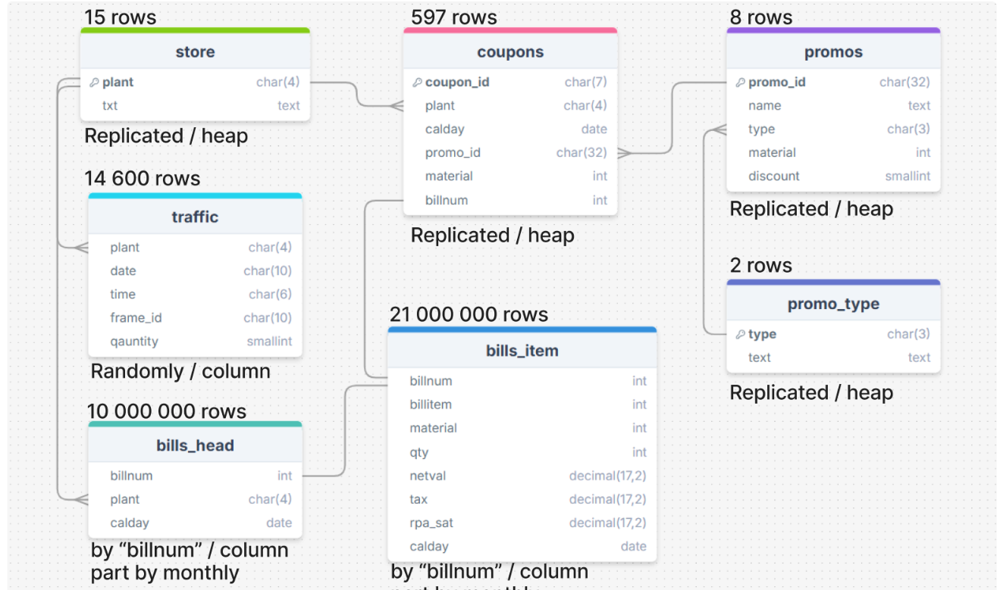



### Таблица с информацией о покупках 
|billnum  |billitem|material  |qty|netval|tax  |rpa_sat|calday    |
|---------|-------:|---------:|--:|-----:|----:|------:|----------|
|900766339|       3|     19067|  1| 55.00|11.00|  66.00|2021-01-04|
|900455580|       9|1000011135|  1|356.67|71.33| 428.00|2021-01-04|
|900815209|       7| 103381758|  1|  0.83| 0.17|   1.00|2021-01-04|
|900539391|       5|2029859004|  1|459.09|45.91| 505.00|2021-01-04|
|900642636|       1|    231168|  1| 29.17| 5.83|  35.00|2021-01-04|





### Отношение номера чека - магазина - даты операции
|billnum  |plant|calday    |
|---------|-----|----------|
|900391394|M003 |2021-01-01|
|900411774|M007 |2021-01-01|
|900421200|M003 |2021-01-01|
|900422381|M011 |2021-01-01|
|900434234|M003 |2021-01-01|





### Таблица с информацией по купонам
| plant| calday     | coupon_id  | promo_id                        | material  | billnum     |
|------|------------|---------|------------------------------------|----------:|-------------|
| M003 | 2021-01-01 | A000001 | 3638616237621EEBA4EF73792BE10EAE   | 32204     | 900443454   |
| M003 | 2021-01-01 | A000002 | 3638616237621ECJIO7R77DF8B364EB8   | 55414     | 900443454   |
| M003 | 2021-01-01 | A000003 | 3638616237621EEBA4EF75D65ADA0EB1   | 55417     | 900443454   |
| M003 | 2021-01-01 | A000004 | 3638616237621EEBA4EF77DF8B364EB8   | 70245     | 900443454   |
| M005 | 2021-01-01 | A000005 | 005056A75DDC1EEAA9BC2CA7D9AA66EE   | 7000009745| 900498502   |





### Таблица с количеством посещений магазина за каждый час работы
plant|calday     |time  |frame_id  |quantity|
-----|-----------|------|----------|-------:|
M001 |2021-01-01 | 80000|1245776664|       2|
M001 |2021-01-01 | 90000|1245776667|       2|
M001 |2021-01-01 |100000|1245776670|       1|
M001 |2021-01-01 |110000|1245776673|       0|
M001 |2021-01-01 |120000|1245776676|       0|





### Таблица с актуальными промо акциями на сегоднишний день
promo_id                        |name        |promo_type|material|discount|
--------------------------------|:-----------|---------:|-------:|-------:|
3638616237621EEBA4EF73792BE10EAE|Выгода      |         2|   32204|       3|
3638616237621EEBA4EF84B64BB40F85|Купи вот это|         1|   55414|      50|
3638616237621ECJIO7R77DF8B364EB8|Выгода      |         2|   55414|      10|
3638616237621EEBA4EF75D65ADA0EB1|Купи вот это|         1|   55417|      60|
3638616237621EEBA4EF77DF8B364EB8|Выгода      |         2|   70245|      20|





### Отношение код магазина - название магазина
plant|txt       |
-----|----------|
M001 |Магазин №1|
M002 |Магазин №2|
M003 |Магазин №3|
M004 |Магазин №4|
M005 |Магазин №5|





### Таблица с типами промо акций
|promo_type|txt                             |
|----------|--------------------------------|
|         1|Скидка в абсолютном выражении   |
|         2|Скидка в относительном выражении|





### Таблица для сохранения историчности данных согласно уровню SCD 2.
Обязательным подходом является добавлением 2 новых полей:
- `valid_from` - Время начала действия записи. Всегда заполнено
- `valid_to` - Время окончания действия записи
> - Если значение `valid_to` = `Null` - запись является актуальной на сегодняшний день
> - Если значение `valid_to` != `Null` - запись была актуальна до указанного времени. Запись на источнике либо была удалена, либо была изменена

|promo_id                        |hash_diff                       |name        |promo_type|material  |discount|dbt_scd_id                      |dbt_updated_at         |dbt_valid_from         |dbt_valid_to|
|--------------------------------|--------------------------------|------------|----------|----------|--------|--------------------------------|-----------------------|-----------------------|------------|
|3638616237621EEBA4EF73792BE10EAE|3cfa7a5bd5093a370b01f404e52bc949|Выгода      |2         |     32204|       3|6a1920d8522ca38ec84e4afd1f356179|2024-12-16 11:09:06.303|2024-12-16 11:09:06.303|            |
|3638616237621EEBA4EF84B64BB40F85|c4147db07634a63273cd575eee975575|Купи вот это|1         |     55414|      50|976f872083d87aeac409d00a2feedbde|2024-12-16 11:09:06.303|2024-12-16 11:09:06.303|            |
|3638616237621ECJIO7R77DF8B364EB8|5e847dc863fec48a0fe315c7b6b5784d|Выгода      |2         |     55414|      10|1fd996ec24885748cc6e864e80033f6a|2024-12-16 11:09:06.303|2024-12-16 11:09:06.303|            |
|3638616237621EEBA4EF75D65ADA0EB1|700ff415bde6e4a9825b08778dadb447|Купи вот это|1         |     55417|      60|55d5c9134001786ee82b3ad0c33c1601|2024-12-16 11:09:06.303|2024-12-16 11:09:06.303|            |
|3638616237621EEBA4EF77DF8B364EB8|d75d703c5460c65aa4a70d409fca35a5|Выгода      |2         |     70245|      20|55291ab59ee4d7fcecca6f70a7ebcf3c|2024-12-16 11:09:06.303|2024-12-16 11:09:06.303|            |
|005056A75DDC1EEAA9BC2CA7D9AA66EE|67e9e1518c30823302abc07189a63de6|Ну купи     |1         |7000009745|     240|c5ee05e224aaf94f6fed38fb00960d1d|2024-12-16 11:09:06.303|2024-12-16 11:09:06.303|            |
|005056A75DDC1EEAAAB458BDA341E971|6ab0c8f12e04124248d5558adfd60576|Ну купи     |1         |     55480|     240|c2230bb0a25e5d4322ba31a45e792e25|2024-12-16 11:09:06.303|2024-12-16 11:09:06.303|            |
|005056A75DDC1EEAAAB5461946344AFB|ddd3a16ddc55d4eef2491f9b81dfc095|Ну купи     |1         |     95035|     240|cfc45f9ecaed5bdd02c1be8c4324a46c|2024-12-16 11:09:06.303|2024-12-16 11:09:06.303|            |





### Количество чеков по магазинам
> Обновляется каждый раз при выполнении модели за указанный период

|plant|bills_count|
|-----|-----------|
|M011 |          6|
|M005 |         12|
|M010 |          8|
|M002 |          6|
|M009 |          6|





### Общий трафик по магазинам
> Обновляется каждый раз при выполнении модели за указанный период

|plant|total_traffic|
|-----|-------------|
|M011 |           32|
|M005 |           16|
|M010 |           64|
|M002 |           32|
|M015 |           39|





### Информация по общему обороту и количеству проданных товаров
> Обновляется каждый раз при выполнении модели за указанный период

|plant|total_amount|total_item_count|
|-----|------------|----------------|
|M011 |     1552.00|              13|
|M005 |     8360.00|              31|
|M010 |    10116.00|              33|
|M002 |    18917.00|              14|
|M009 |     4683.00|              21|





### Информация по общей сумме товаров со скидкой и количеству товаров со скидкой
> Обновляется каждый раз при выполнении модели за указанный период

|plant|total_discount_amount|count_item_discount|
|-----|---------------------|-------------------|
|M001 |                  480|                  2|
|M003 |                  862|                 12|
|M004 |                    3|                  1|
|M005 |                  243|                  2|
|M006 |                  480|                  2|





### Информация по общей сумме товаров со скидкой и количеству товаров со скидкой
> При запуске модели создается отдельная `view` в схеме `dm` с названием: "order_ + date_from + '_' + date_to"

|plant|total_amount|total_discount_amount|total_without_discount|total_item_count|bills_count|total_traffic|count_item_discount|discount_item_rate|avg_items_in_bill|conversion_rate|avg_bill|avg_revenue_per_customer|
|-----|------------|---------------------|----------------------|----------------|-----------|-------------|-------------------|------------------|-----------------|---------------|--------|------------------------|
|M001 |     2694.00|                  480|               2214.00|              31|         10|           37|                  2|               6.5|             3.10|          27.03|   269.4|                    72.8|
|M003 |    43817.00|                  862|              42955.00|             170|         32|           35|                 12|               7.1|             5.31|          91.43|  1369.3|                  1251.9|
|M004 |     6724.00|                    3|               6721.00|              17|          6|           22|                  1|               5.9|             2.83|          27.27|  1120.7|                   305.6|
|M005 |     8360.00|                  243|               8117.00|              31|         12|           16|                  2|               6.5|             2.58|          75.00|   696.7|                   522.5|
|M006 |    11262.00|                  480|              10782.00|              42|          7|           27|                  2|               4.8|             6.00|          25.93|  1608.9|                   417.1|




### Схема центрального слоя хранилища

### Таблицы:
- `bills_item` - таблица фактов / инкрементальная загрузка
- `bills_head` - таблица фактов / инкрементальная загрузка
- `traffic` - таблица фактов / инкрементальная загрузка
- `coupons` - таблица фактов / инкрементальная загрузка
- `stores` - таблица справочник / полная перезагрузка
- `promo_types` - таблица справочник / полная перезагрузка
- `promos` - таблица справочник / полная перезагрузка | историчность SCD 2




### Схема для временного хранения данных из источников
### Таблицы:
- `bills_item` - хранит дельту относительно хранилища
- `bills_head` - хранит дельту относительно хранилища
- `traffic` - хранит дельту относительно хранилища
- `coupons` - хранит дельту относительно хранилища
- `stores` - все актуальные данные на источнике
- `promo_types` - все актуальные данные на источнике
- `promos` - все актуальные данные на источнике

